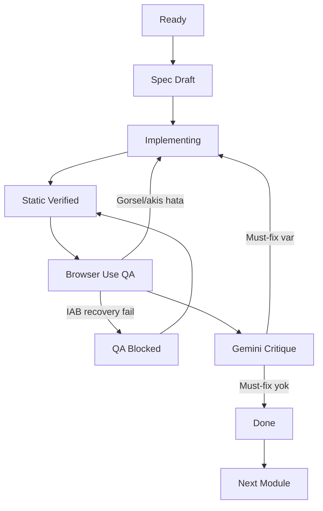

# Autonomous Module Pipeline

Bu dokuman, Dinamik Istasyon'da 10. ve 11. sinif modullerini insan komutu beklemeden ama kalite kapilarini atlamadan uretmek icin kullanilir. Amaç, Kaptan'in tek tek "devam et" demesine gerek kalmadan siradaki modulu secmek, tasarlamak, uygulamak, Browser Use ve Gemini ile kapali cevrim kalite kontrol yapmak ve ancak kanitlar temizse sonraki module gecmektir.

## Roller

| Rol | Sorumluluk | Araclar |
| --- | --- | --- |
| Modul Mimari Ajani | Siradaki modulu secer, SSOT atomlari dogrular, kapsam disini ayirir, tek ana oyuncagi tanimlar. | `docs/MEB_ATOMLARI.md`, `docs/DEVELOPMENT_QUEUE_10_11.md`, `docs/MODULE_DESIGN_GUIDE.md` |
| Uygulama Ajani | Spec'e gore React/TypeScript modulu yazar, route/registry baglar, kodu parcalara ayirir. | `HighSchoolLabShell`, `framer-motion`, mevcut modül kaliplari |
| QA Ajani | Build, statik kontrat, Browser Use akisi, console ve responsive kontrol yapar. | `npm run build`, `npm run module:check`, Browser Use IAB |
| Dis Elestirmen | Gemini 3 Flash ile ekran goruntulerini ogrenci gozuyle puanlar. | Browser Use screenshot, Gemini 3 Flash |
| Dokumantasyon Ajani | Queue, spec, `PROGRESS.md`, `.agent/WORKLOG.md`, `MODULES.md`, `ROADMAP.md` kayitlarini senkron tutar. | Markdown dokumanlari |

## Kaptan Inceleme Paneli ve 3 Hatli Calisma

Yeni manuel kalite akisi `docs/KAPTAN_REVIEW_WORKFLOW.md` icinde tutulur. Ozet kural:

- Tek repo ve tek SSOT korunur.
- Kaptan beklerken `/review-workbench` uzerinden ilkokul, ortaokul veya lise modullerine puan/not birakir.
- Ilkokul ve ortaokul sohbetleri audit-only calisir; kod, registry, spec veya kalite defteri degistirmez.
- Lise/ana uretim sohbeti kod degistiren tek hattir.
- Uretim hatti ayni anda yalniz bir modulu ele alir; Kaptan notlarini `Must Fix`, vitrin adayi ve polish onceligine cevirir.
- Review Workbench'teki `Yanda ac` onizlemesi paneli kaybettirmeden modulu iframe icinde acar; Kaptan notlari localStorage'da tutulur ve JSON olarak disa aktarilir.

Bu bolum, otomasyon hattini degistirmez; sadece Kaptan'in es zamanli goz notlarini guvenli uretim sirasina aktarma seklini tanimlar.

## State Machine



## Modül Uretim Akisi

1. `docs/DEVELOPMENT_QUEUE_10_11.md` icinde once `In Progress`, yoksa ilk `Ready` modul secilir.
2. Atomlar yalniz `docs/MEB_ATOMLARI.md` icinden dogrulanir.
3. Modul icin `docs/module-specs/<sira>-<module-id>.md` yazilir:
   - amaç
   - atom kapsami
   - kapsam disi atomlar
   - tek ana oyuncak
   - gorev akisi
   - route
   - test-id kontrati
   - QA plani
4. Uygulama `types`, `model`, `Scene`, `Controls`, `App` parcalarina bolunur.
5. Registry route ve atom listesi baglanir.
6. Statik kapilar calisir:
   - `npm run module:check <module-id>`
   - `npm run build`
   - `git diff --check`
7. Browser Use IAB ile canli QA calisir:
   - `?qa=1` route acilir
   - ilk viewport screenshot
   - yanlis deneme AstroBot
   - tum dogru gorev zinciri
   - completion
   - orta/mobil viewport smoke
   - console warning/error
8. Gemini 3 Flash'a Browser Use kanitlari gonderilir. Must-fix varsa ayni sahne tekrar duzeltilir ve Browser Use ile dogrulanir.
9. Internal kalite skoru hesaplanir ve `docs/MODULE_QUALITY_SCORECARD.md` icine kanit satiri eklenir.
10. Dokumanlar senkronlanir ve status `Done` yapilir.
11. Ancak bu kapilar temizse siradaki module gecilir.

## Hard Gate Kurallari

- Browser testlerinde sadece Browser Use IAB kullanilir. Computer Use, MCP Docker browser, harici Playwright ve macOS tarayici kontrolu Browser QA yerine gecmez.
- Computer Use otonom browser QA hattina dahil degildir. Sadece Kaptan acikca isterse ve riskli veri/hesap islemi yoksa, browser disi sistem/ekran yardimci islerinde degerlendirilir.
- IAB backend takilirsa once ajan kendi ic recovery merdivenini uygular: Browser Use skill'i tazeler, `setupAtlasRuntime({ backend: 'iab' })` ile yeniden kurar, secili tab yoksa Browser Use icinden yeni tab olusturur, stale runtime/pipe ihtimalinde Node/browser-use bootstrap'ini sifirlar, dev server'i dogrular veya baslatir, route'u taze query ile yeniden yukler ve screenshot zaman asiminda Browser Use DOM/CUA/console kanitlarina dener.
- Bu recovery merdiveninden sonra IAB yine bulunamazsa modül `Done` yapilmaz; `QA Blocked` notu dusulur ve ayni modülde kalinir. Bu durumda da Computer Use, MCP Docker veya harici Playwright fallback olarak kullanilmaz.
- Gemini must-fix aciksa modül `Done` olmaz.
- `npm run build` veya `git diff --check` fail ise sonraki module gecilmez.
- Atom uydurulmaz; SSOT disinda kazanım eklenmez.

## Gemini 3 Flash Degerlendirme Sablonu

```text
Sen Dinamik İstasyon için bağımsız görsel/pedagojik QA eleştirmenisin.
Hedef: 10-11. sınıf matematik modülünün öğrenci ekranını değerlendir.

Modül:
- Ad: {{module_name}}
- Route: {{route}}?qa=1
- Atomlar: {{atom_ids}} - yalnız bu kapsamı değerlendir, yeni kazanım uydurma.
- Kapsam dışı: {{out_of_scope}}
- Ana oyuncak: {{main_manipulative}}
- Görevler: {{missions}}
- Hedef kullanıcı: lise öğrencisi, ilk 3 saniyede neyle oynayacağını anlamalı.

Ekran görüntüleri:
1. Başlangıç
2. Yanlış deneme
3. Görev başarı ekranları
4. Completion
5. Mobil veya embed smoke

Kurallar:
- Browser Use ekran kanıtına göre konuş; görünmeyen şeyi varsayma.
- Matematik doğruluğu, ilk 3 saniye netliği, üst üste binme/kırpılma, responsive/embed, bilişsel yük ve etkileşim hissine odaklan.
- “Güzel olurdu” ile “bitmeden düzelmeli” ayrımını net yap.
- Kapsam büyüten önerileri v2/future olarak ayır.

Çıktı:
VERDICT: PASS | FAIL | PASS_WITH_WARNINGS
SCORE: 0-100
MUST_FIX:
SHOULD_FIX:
MATH_ACCURACY:
FIRST_3_SECONDS:
VISUAL_LAYOUT:
RESPONSIVE_EMBED:
INTERACTION_ACCESSIBILITY:
COGNITIVE_LOAD:
V2_IDEAS_NOT_BLOCKING:
```

## Pass/Fail Skor Karti

| Kapi | Puan | Fail kosulu |
| --- | ---: | --- |
| SSOT ve kapsam | 10 | Atom uydurma, kapsam sisirme, route/registry eksik |
| Kod/mimari kontrat | 15 | `any`, spagetti dosya, iframe root kuralı bozuk, overlay tiklamayi engelliyor |
| Browser Use-only canli QA | 15 | IAB yok veya baska arac Browser QA yerine kullanildi |
| Gorev akisi | 20 | Yanlis deneme yok, dogru zincir tamamlanmiyor, completion gorunmuyor |
| Gorsel/UX | 15 | Ilk viewport anlasilmiyor, ogeler cakisiyor, oyuncak matematiksel anlam tasimiyor |
| Responsive/embed | 10 | Mobil/orta viewport kirpma, yatay tasma, aksiyon kaybi |
| Console/build/diff | 10 | Build fail, diff whitespace fail, yeni console warning/error |
| Gemini kapanisi | 5 | Must-fix acik veya matematik/güven hatasi cozulmemis |

Geçiş kuralı: Hard gate'ler temiz, internal skor en az `90/100`, Gemini skoru en az `85/100` ve Gemini `MUST_FIX` bos.

## Uzun Kosu Sinif Kilidi

Aktif uzun kosu sinifi: **11. sinif**.

- `docs/DEVELOPMENT_QUEUE_10_11.md` icinde once 11. siniftaki `In Progress`, sonra 11. siniftaki `Ready` modul secilir.
- 11. sinifta `Ready` kalmazsa, en ustteki 11. sinif `Backlog` modulu ajan tarafindan `Ready -> In Progress` yapilir ve spec'e baslanir.
- 11. sinif tamamen `Done` olmadan 10. sinif backlog'una donulmez.
- Bir modül kalite skoru veya Browser Use/Gemini kapısında takılırsa sinif degistirilmez; ayni modül düzeltilir.

## Kaptan Ne Yapar?

- Yeni ürün zevki veya pedagojik yön değiştirir.
- Büyük kapsam kararlarında tercih bildirir.
- Yalniz gercek dis etkenlerde devreye girer: elektrik/internet kesintisi, Codex uygulamasinin tamamen kilitlenmesi, hesap/oturum engeli veya fiziksel makine erisimi.
- Bitmiş modülleri ürün gözüyle değerlendirir.
- Publish/deploy gibi dış etki yaratan adımları onaylar.

## Ajan Ne Yapar?

- Kuyruktan modül seçer.
- Spec yazar.
- Uygular.
- Build/statik/Browser Use/Gemini kapılarını çalıştırır.
- Browser Use/IAB, dev server, stale tab, screenshot timeout ve benzeri ic operasyon takilmalarini kendi recovery merdiveniyle cozer; Kaptan'a ancak dis etken veya dis etki onayi gerekiyorsa gelir.
- Must-fixleri düzeltir.
- Dokümanları günceller.
- Modül `Done` olunca sıradakine geçer.
